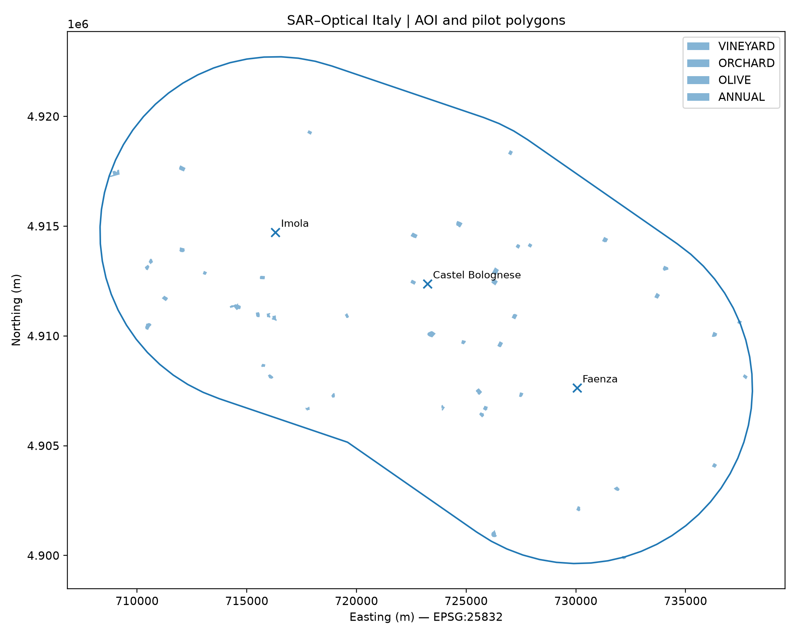
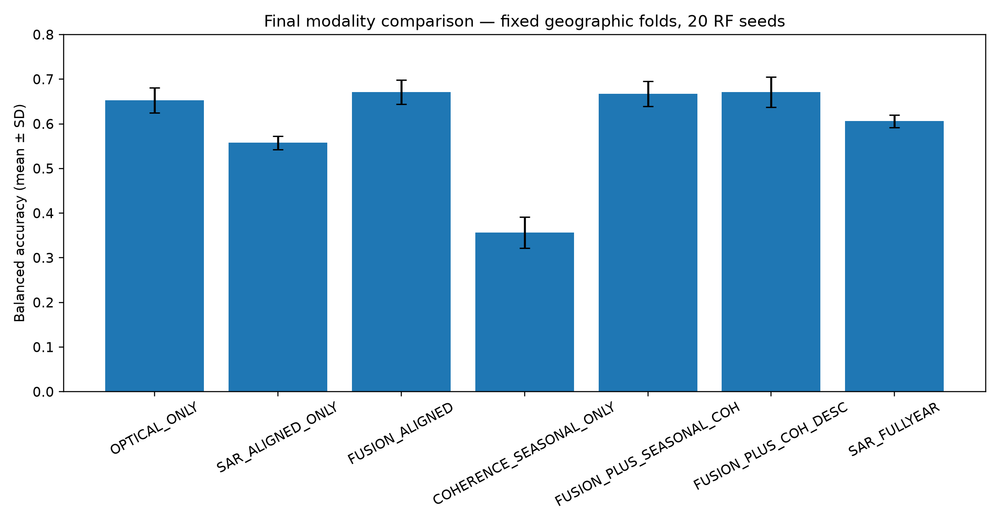
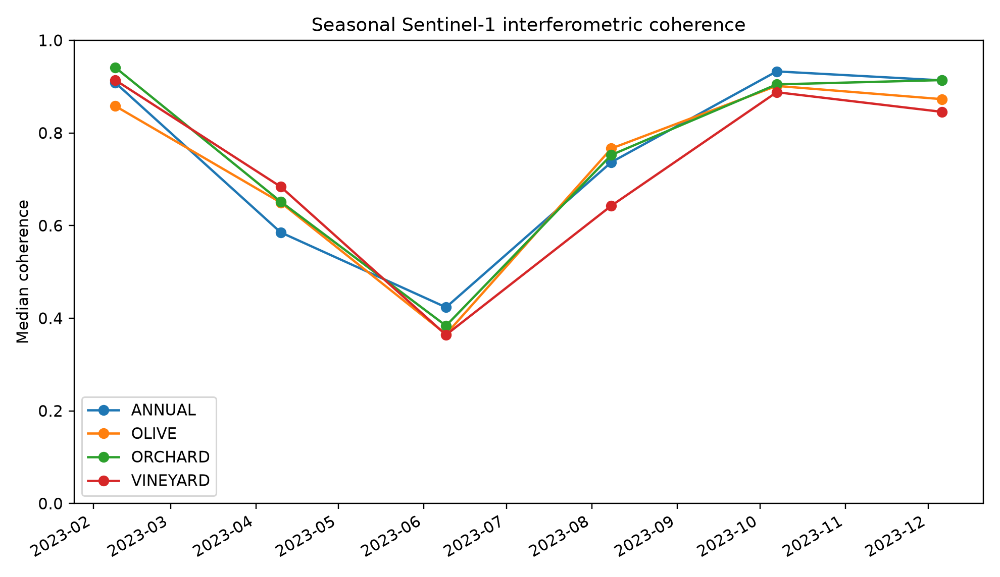
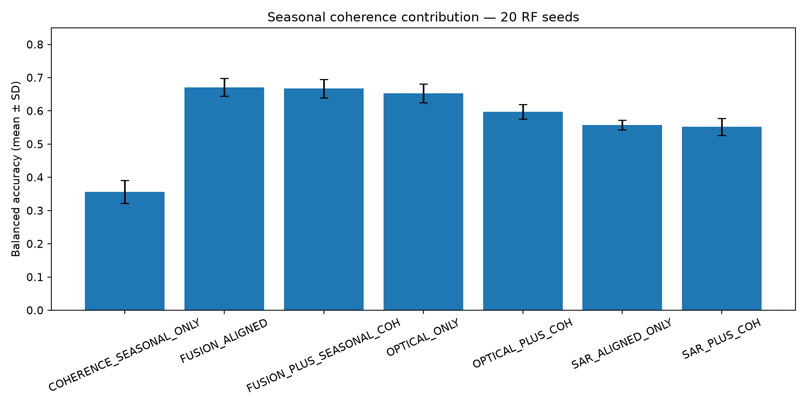

# SAR–Optical Multi-Sensor Monitoring of Perennial Crops in Emilia-Romagna, Italy

[](https://doi.org/10.5281/zenodo.23041619)

A reproducible agricultural remote-sensing pilot integrating **Sentinel-1 C-band SAR**, **Sentinel-2 optical imagery**, and **Sentinel-1 SLC interferometric coherence** over the Imola–Castel Bolognese–Faenza corridor in Emilia-Romagna, Italy.

**Author:** Marcel de Mello Innocentini — Agropixel  
**ORCID:** 0009-0006-2409-0946  
**Version:** 1.0  
**Canonical archive:** https://doi.org/10.5281/zenodo.23041619



## Objective

The pilot asks:

> **How much does C-band SAR add to Sentinel-2 optical information for structural and seasonal characterization of perennial crops?**

The analytical sample contains **47 official 2023 land-use polygons**: 12 vineyards, 12 orchards, 11 olive groves, and 12 annual-crop comparison polygons.

## Data actually processed

| Source | Representation | Scope |
|---|---|---:|
| Sentinel-1 | RTC gamma0 VV/VH | 30 acquisitions in 2023 |
| Sentinel-1 | SLC interferometric coherence | 6 twelve-day pairs |
| Sentinel-2 | L2A optical indices | 5 dates |
| Regione Emilia-Romagna | Uso del Suolo 2023 | 47 pilot polygons |
Optical features include **NDVI, NDRE, NDMI, and GNDVI**. SAR features include **VV, VH, VH/VV**, full-year temporal descriptors, and SLC-derived coherence.

## Processing principles

- Quantitative SAR analysis uses **RTC gamma0**, not raw GRD digital numbers.
- SAR polygon means are aggregated in **linear power** and converted to dB afterward.
- Sentinel-2 reflectance scaling and offset are applied **before** index calculation.
- The primary spatial support is a **20 m inward polygon core**.
- Classification uses **leave-one-zone-out geographic validation** across Imola, Castel Bolognese, and Faenza.
- Algorithmic stability is evaluated over **20 Random Forest seeds** with fixed geographic folds.
- Results are exploratory; no yield, physiology, causal agronomic, or operational crop-mapping claims are made.

## Main result



| Representation | Balanced accuracy (mean ± SD) | Macro-F1 (mean ± SD) |
|---|---:|---:|
| Optical only | 0.653 ± 0.028 | 0.643 ± 0.027 |
| Aligned SAR only | 0.558 ± 0.015 | 0.533 ± 0.016 |
| **Optical + aligned SAR** | **0.671 ± 0.027** | **0.663 ± 0.028** |
| Full-year SAR descriptors | 0.606 ± 0.014 | 0.579 ± 0.016 |

Temporally aligned Sentinel-1/Sentinel-2 fusion produced a **modest but repeatable improvement** over optical-only classification.

## Interferometric coherence

Six 12-day SLC pairs were processed through **ASF HyP3/GAMMA** using 10×2 looks and 40 m output spacing.




Coherence was technically successful but did **not** provide a stable incremental classification gain. Adding six seasonal coherence features changed mean balanced accuracy from **0.671 to 0.667**. Compact temporal coherence descriptors produced **0.6715**, effectively identical to fusion without coherence.

Perpendicular baselines varied from approximately **−225.6 m to +173.3 m**, so absolute differences among seasonal coherence pairs are not interpreted as pure phenology.

## Repository structure

```text
code/       processing, extraction, validation and plotting scripts
data/       compact polygon-level analytical tables
metadata/   scene catalogues, processing parameters and provenance
figures/    main maps and result figures
docs/       final technical summaries and archival metadata
```

Large raw and derived satellite rasters are **not duplicated** in this repository. Scene identifiers, acquisition dates, orbit geometry, processing parameters, and analytical outputs are retained so the workflow can be reproduced from public sources.

## Reproducibility

The complete archival release, technical report, and presentation are available on Zenodo:

**https://doi.org/10.5281/zenodo.23041619**

The Zenodo record is the canonical archived version of this project.

## Citation

> Innocentini, M. de M. (2026). *SAR–Optical Multi-Sensor Monitoring of Perennial Crops in Emilia-Romagna, Italy* (Version 1.0). Zenodo. https://doi.org/10.5281/zenodo.23041619
A machine-readable citation is provided in [CITATION.cff](CITATION.cff).

## Licenses

- Original source code: **MIT License**
- Original documentation, figures, and technical material: **CC BY 4.0**
- Third-party datasets and satellite products remain subject to their respective source licenses.

## Scope

This repository documents **hands-on SAR processing and interpretation in agriculture**, including Sentinel-1 RTC backscatter, VV/VH analysis, SLC-derived interferometric coherence, temporal feature engineering, quality control, SAR–optical fusion, and geographic validation.

Negative results are retained where a tested representation did not improve the model.
